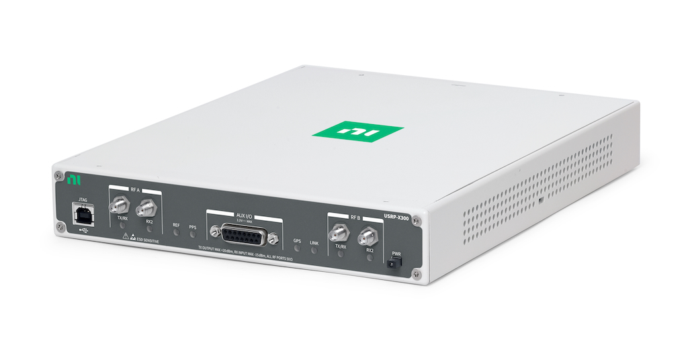
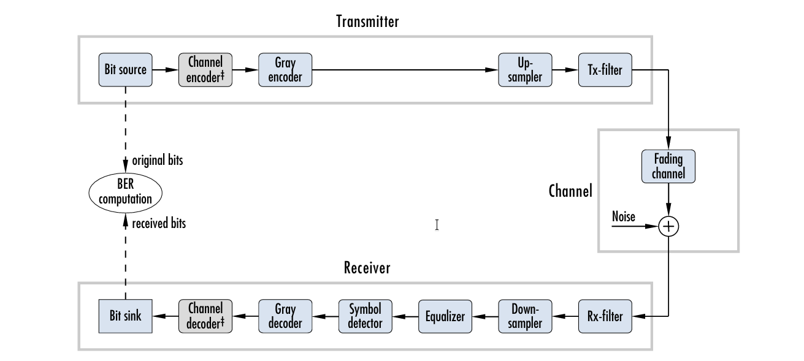
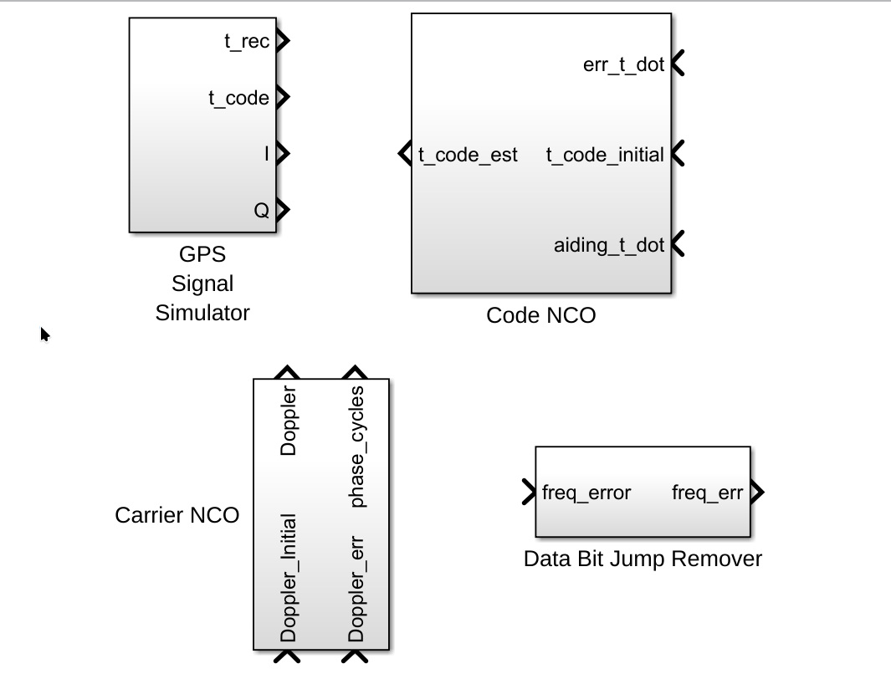
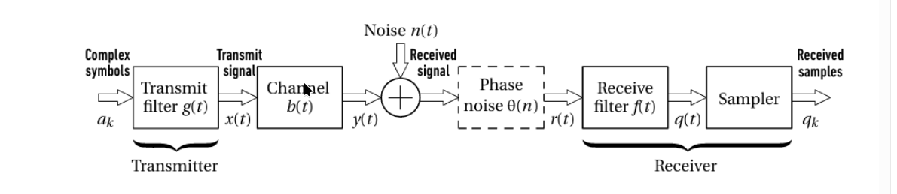
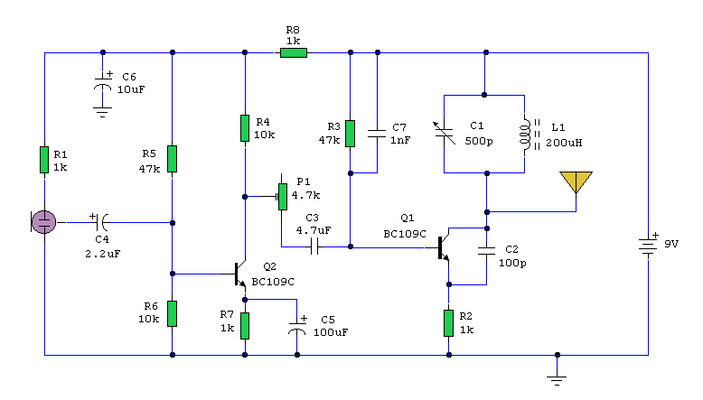
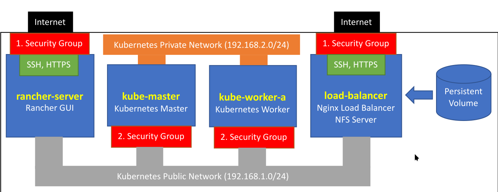
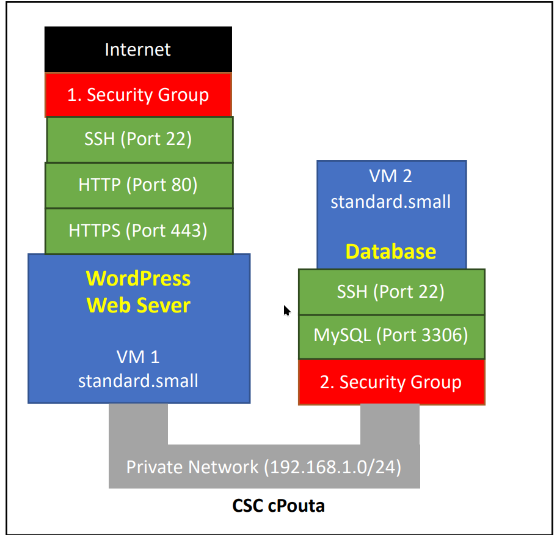

# 🛠 Projects

  <!-- SDR Project -->
  

    
    

      <h3>Software-Defined Radio Communication Chain</h3>
      

        End-to-end SDR communication chain implemented using USRP and LabVIEW,
        focusing on real-time transmission, reception, and RF impairment analysis.
      

      

        SDR
        USRP
        LabVIEW
        RF
      

    

  

  <!-- MATLAB Digital Comms -->
  

    
    

      <h3>Digital Communication System Simulations</h3>
      

        MATLAB-based simulations of QAM, PSK, and OFDM systems with BER analysis
        under AWGN and fading channels.
      

      

        MATLAB
        QAM
        PSK
        OFDM
      

    

  

  <!-- GPS Receiver -->
  

    
    

      <h3>Software-Based GPS Receiver</h3>
      

        Complete GPS receiver chain designed in Simulink, including signal
        acquisition, tracking loops, and navigation solution.
      

      

        Simulink
        GPS
        Signal Processing
      

    

  

  <!-- Single Carrier M-QAM -->
  

    
    

      <h3>Single-Carrier M-QAM under Fading</h3>
      

        Performance evaluation of single-carrier M-QAM systems under
        frequency-selective fading and phase noise impact on symbol detection.
      

      

        M-QAM
        Fading
        Phase Noise
        BER
      

    

  

  <!-- AM Transmitter -->
  

    
    

      <h3>AM Transmitter Design</h3>
      

        Design and implementation of an AM transmitter with emphasis on
        modulation theory, spectral analysis, and RF communication principles.
      

      

        AM
        Modulation
        RF
        DSP
      

    

  

<!-- Kubernetes Cloud Infrastructure Project -->

  
  

    <h3>
      <a href="kubernetes-ecommerce.html">
        Kubernetes-Based Cloud Infrastructure for Scalable E-Commerce
      </a>
    </h3>
    

      Production-style Kubernetes infrastructure deployed on CSC cPouta,
      hosting a scalable EverShop e-commerce platform with PostgreSQL,
      persistent storage, and Nginx-based ingress and load balancing.
    

    

      Kubernetes
      Terraform
      Docker
      Rancher
      Helm
      Nginx
      PostgreSQL
      Cloud
    

  

<!-- WordPress Cloud + Disaster Recovery Project -->

  
  

    <h3>
      <a href="wordpress-cloud-disaster-recovery.html">
        Cloud-Hosted WordPress Platform with Disaster Recovery
      </a>
    </h3>
    

      Production-style WordPress deployment on CSC cPouta with isolated web and
      database tiers, HTTPS, persistent storage, and full MySQL disaster
      recovery from backup.
    

    

      Cloud
      WordPress
      OpenStack
      Disaster Recovery
      MySQL
      Nginx
      Linux
      SSL
    

  

